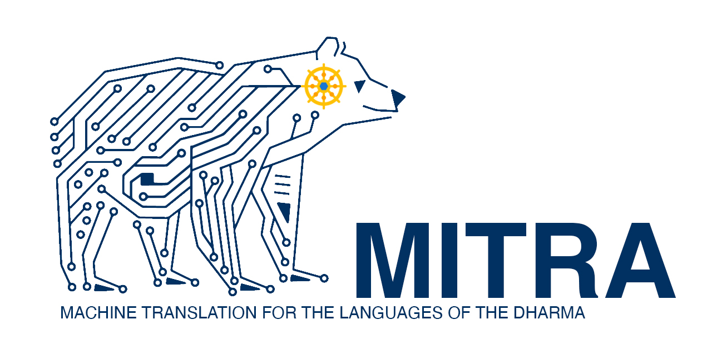

# DharmaMitra Agent Starterpack

Download this folder, open it in Claude Code, and you get a working setup for:

1. **Translating classical Asian Buddhist texts** (Tibetan, Chinese, Pali, Sanskrit → English / German / …) via DharmaMitra's multi-witness translation API, with your reference glossaries and prior translations threaded into every call.
2. **Critical-edition / philological work** — cross-language parallel retrieval to surface variant readings, propose emendations, and assemble an apparatus.

No DharmaMitra account or API key required. Endpoints are public.

## Setup

**With git:**

```bash
git clone https://github.com/dharmamitra/dharmamitra-claude-code-agent.git
cd dharmamitra-claude-code-agent
```

**Without git** — download the ZIP from the repo page (green **Code** button → **Download ZIP**), then unzip and `cd` into `dharmamitra-claude-code-agent-main`. Or in one line:

```bash
curl -LO https://github.com/dharmamitra/dharmamitra-claude-code-agent/archive/refs/heads/main.zip && unzip main.zip && cd dharmamitra-claude-code-agent-main
```

Then run `claude` in the folder.

Requires: `jq` (`brew install jq` / `apt install jq`) and Claude Code. Optional for binary references: `pandoc` + `poppler` (`brew install pandoc poppler`).

## Translating a text

1. Drop source(s) under `sources/`, using language suffixes for multi-witness texts:
   ```
   sources/vajracchedika.sa.txt
   sources/vajracchedika.bo.txt
   ```
2. Drop glossaries, style guides, or any existing translations of this work under `references/`. Plain text, Markdown, DOCX, and PDF all work.
3. Run `/translate sources/vajracchedika` in Claude.

Claude chunks the source into 3–5-sentence units and calls `cat-translate` iteratively, writing to `output/translations/vajracchedika.md`. Each call's `context` field carries forward the prior translated chunks of this document plus the relevant glossary lines, so terminology and voice stay consistent across long texts. Claude pauses every ~5 chunks for you to adjust terminology; corrections you write into the brief are picked up on the next chunk.

If you've already translated chapters 1–3 elsewhere and want Claude to continue with chapter 4, drop that prior translation under `references/` — it'll be woven into the context for every call.

## Building a critical apparatus

1. Put the anchor passage in `sources/`, or paste it inline.
2. Run `/critical-edition sources/passage.sa.txt`.

Claude retrieves parallels via `/primary/` (semantic search across all canon languages, `max_depth: 30`, ranking disabled), triages canonical vs. commentary citations, compares each witness against the anchor, and writes a structured apparatus to `output/critical-editions/<work>.md` with `src_link`s back to the DharmaMitra reading room for every citation.

## Other commands

- `/find-parallels <text>` — search the corpus for parallels of a given passage or phrase.
- `/lookup-segment <segmentnr>` — fetch one canonical passage by ID, e.g. `BO_K01_D0006:42b-3`.

## Folder layout

```
.
├── CLAUDE.md                    # project context — read first by Claude
├── .claude/
│   ├── settings.json            # allowlist for the scripts (no permission prompts)
│   ├── agents/                  # translator, philologist, corpus-searcher, reference-reader
│   └── commands/                # /translate, /find-parallels, /critical-edition, /lookup-segment
├── scripts/                     # curl wrappers for both endpoints
├── sources/                     # ← drop source texts here
├── references/                  # ← drop glossaries / prior translations here
├── output/                      # ← Claude writes translations + apparatus here
└── examples/                    # ready-to-run request bodies
```

## API endpoints

Two endpoints, both public, JSON in / JSON out, synchronous:

| Endpoint | Purpose | Wrapper | Latency |
| --- | --- | --- | --- |
| `POST /cat-translate/v1/translate` | Multi-witness translation with user-supplied context | `./scripts/cat-translate.sh` | 3–8 s |
| `POST /primary/` | Search canonical corpus by meaning or exact text | `./scripts/primary-search.sh` | 0.3–3 s |

Full reference and field schemas in `CLAUDE.md`.

## Customising

- Translation style: edit `output/translations/<work>.brief.md` between runs. The translator agent re-reads it on the next chunk.
- Allowed commands: `.claude/settings.json`.
- Agents & slash commands: `.claude/agents/*.md` and `.claude/commands/*.md` are plain Markdown with YAML frontmatter — edit freely.

## Troubleshooting

- **Curl 524** — cat-translate hit the 100 s upstream cap. Chunk smaller.
- **0 results from `/primary/`** — broaden `filter_source_language` to `"all"`; switch to `search_type: "semantic_only"` for cross-script queries.
- **`jq: command not found`** — `brew install jq` / `apt install jq`.
- **Terminology drifting in a long translation** — open `output/translations/<work>.brief.md`, tighten the `style_instruction`, and tell Claude to restart from where drift began.

## Citations

`/primary/` returns a `src_link` deep-linking to the DharmaMitra reading room with the segment highlighted. The agents cite using those links verbatim — don't construct DharmaMitra URLs yourself.
